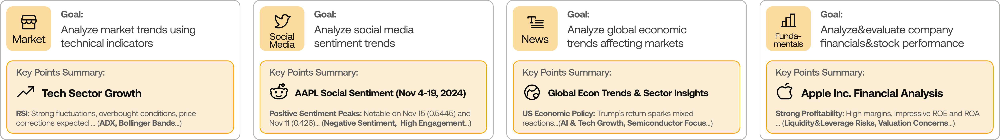

<p align="center">
  
</p>

<div align="center" style="line-height: 1;">
  <a href="https://arxiv.org/abs/2412.20138" target="_blank"></a>
  <a href="https://discord.com/invite/hk9PGKShPK" target="_blank"></a>
  <a href="https://x.com/TauricResearch" target="_blank"></a>
  <a href="https://github.com/TauricResearch/" target="_blank"></a>
</div>
<<<<<<< HEAD

---

> **⚠️ 重要声明：Mind TradingAgent 是 [TauricResearch/TradingAgents](https://github.com/TauricResearch/TradingAgents) 的一个独立分支，并非官方项目。** 
> 
> 此项目（mind_TradingAgent）基于 TradingAgents v0.2.5 进行私有化定制与二次开发。原项目由 Tauric Research 团队维护，采用 MIT 许可证。
> 本分支的修改和定制内容由 Mindlx 负责，与原始项目无关。
=======
<br>
<div align="center">
  <a href="https://github.com/TauricResearch" target="_blank"></a>
</div>
<br>
<div align="center">
  <!-- Keep these links. Translations will automatically update with the README. -->
  <a href="https://www.readme-i18n.com/TauricResearch/TradingAgents?lang=de">Deutsch</a> | 
  <a href="https://www.readme-i18n.com/TauricResearch/TradingAgents?lang=es">Español</a> | 
  <a href="https://www.readme-i18n.com/TauricResearch/TradingAgents?lang=fr">français</a> | 
  <a href="https://www.readme-i18n.com/TauricResearch/TradingAgents?lang=ja">日本語</a> | 
  <a href="https://www.readme-i18n.com/TauricResearch/TradingAgents?lang=ko">한국어</a> | 
  <a href="https://www.readme-i18n.com/TauricResearch/TradingAgents?lang=pt">Português</a> | 
  <a href="https://www.readme-i18n.com/TauricResearch/TradingAgents?lang=ru">Русский</a> | 
  <a href="https://www.readme-i18n.com/TauricResearch/TradingAgents?lang=zh">中文</a>
</div>
>>>>>>> upstream/main

---

# Mind TradingAgent: 私有定制多智能体 LLM 金融交易框架

## 更新日志 / News

<<<<<<< HEAD
- [2026-06] **TradingAgents v0.3.0** released with a verified data-access contract, an expanded provider registry (NVIDIA, Kimi, Groq, Mistral, Bedrock, and any OpenAI-compatible endpoint), FRED and Polymarket data vendors, a current-generation model catalog, and a CI gate. See [CHANGELOG.md](CHANGELOG.md) for the full list.
=======
## News
- [2026-07] **TradingAgents v0.3.1** released with correctness and stability fixes: Alpha Vantage look-ahead filtering, graph-router crash-safety, graph-shape-aware checkpoint resume, working crypto sentiment sources, a configurable LLM retry budget, Bedrock API-key auth, and Claude Sonnet 5 / Fable 5 support. See [CHANGELOG.md](CHANGELOG.md) for the full list.
- [2026-06] **TradingAgents v0.3.0** released with a verified data-access contract, an expanded provider registry (NVIDIA, Kimi, Groq, Mistral, Bedrock, and any OpenAI-compatible endpoint), FRED and Polymarket data vendors, a current-generation model catalog, and a CI gate.
>>>>>>> upstream/main
- [2026-05] **TradingAgents v0.2.5** released with the grounded Sentiment Analyst, GPT-5.5 etc. model coverage, Qwen/GLM/MiniMax dual-region support, `TRADINGAGENTS_*` env-var configurability with API-key auto-detection, remote Ollama support, non-US alpha benchmarks, and ticker path-traversal hardening.
- [2026-04] **TradingAgents v0.2.4** released with structured-output agents (Research Manager, Trader, Portfolio Manager), LangGraph checkpoint resume, persistent decision log, DeepSeek/Qwen/GLM/Azure provider support, Docker, and a Windows UTF-8 encoding fix.
- [2026-03] **TradingAgents v0.2.3** released with multi-language support, GPT-5.4 family models, unified model catalog, backtesting date fidelity, and proxy support.
- [2026-03] **TradingAgents v0.2.2** released with GPT-5.4/Gemini 3.1/Claude 4.6 model coverage, five-tier rating scale, OpenAI Responses API, Anthropic effort control, and cross-platform stability.
- [2026-02] **TradingAgents v0.2.0** released with multi-provider LLM support (GPT-5.x, Gemini 3.x, Claude 4.x, Grok 4.x) and improved system architecture.
- [2026-01] **Trading-R1** [Technical Report](https://arxiv.org/abs/2509.11420) released, with [Terminal](https://github.com/TauricResearch/Trading-R1) expected to land soon.

<<<<<<< HEAD
- [2026-05] **基于 TradingAgents v0.2.5 分支**，重命名为 `mind_tradingagent`，开始私有定制化开发。
=======
<div align="center">

🚀 [TradingAgents](#tradingagents-framework) | ⚡ [Installation & CLI](#installation-and-cli) | 🎬 [Demo](https://www.youtube.com/watch?v=90gr5lwjIho) | 📦 [Package Usage](#tradingagents-package) | 🤝 [Contributing](#contributing) | 📄 [Citation](#citation)

</div>
>>>>>>> upstream/main

---

<<<<<<< HEAD
本框架将复杂的交易任务分解为多个专业化角色，确保系统在市场分析和决策中具备稳健、可扩展的能力。

### 分析师团队
- 基本面分析师：评估公司财务和业绩指标，识别内在价值和潜在风险
- 情绪分析师：聚合新闻头条、StockTwits 和 Reddit 讨论，评估短期市场情绪
- 新闻分析师：监控全球新闻和宏观经济指标，解读事件对市场状况的影响
- 技术分析师：利用技术指标（如 MACD 和 RSI）检测交易模式和预测价格走势

### 研究员团队
- 由看涨和看空研究员组成，对分析师团队的见解进行批判性评估。通过结构化辩论，平衡潜在收益与内在风险。

### 交易员智能体
- 综合分析师和研究员报告，做出知情的交易决策，确定交易的时机和规模。
=======
## TradingAgents Framework
>>>>>>> upstream/main

### 风险管理和投资组合管理
- 通过评估市场波动性、流动性等风险因素，持续评估投资组合风险。风险管理团队评估和调整交易策略，为投资组合经理提供评估报告以做出最终决策。

---

## 安装与 CLI

---

Our framework decomposes complex trading tasks into specialized roles.

### Analyst Team
- Fundamentals Analyst: Evaluates company financials and performance metrics, identifying intrinsic values and potential red flags.
- Sentiment Analyst: Aggregates news headlines, StockTwits, and Reddit chatter into a single sentiment read to gauge short-term market mood.
- News Analyst: Monitors global news and macroeconomic indicators, interpreting the impact of events on market conditions.
- Technical Analyst: Utilizes technical indicators (like MACD and RSI) to detect trading patterns and forecast price movements.

<p align="center">
  
</p>

### Researcher Team
- Comprises both bullish and bearish researchers who critically assess the insights provided by the Analyst Team. Through structured debates, they balance potential gains against inherent risks.

<p align="center">
  
</p>

### Trader Agent
- Composes reports from the analysts and researchers to make informed trading decisions, determining the timing and magnitude of trades.

<p align="center">
  
</p>

### Risk Management and Portfolio Manager
- Continuously evaluates portfolio risk by assessing market volatility, liquidity, and other risk factors. The risk management team evaluates and adjusts trading strategies, providing assessment reports to the Portfolio Manager for final decision.
- The Portfolio Manager approves/rejects the transaction proposal. If approved, the order will be sent to the simulated exchange and executed.

<p align="center">
  
</p>

---

### 安装

克隆此仓库：
```bash
git clone https://github.com/Mindlx/mind_TradingAgents.git
cd mind_TradingAgent
```

创建虚拟环境（推荐 Python 3.10+）：
```bash
conda create -n mind_tradingagent python=3.10
conda activate mind_tradingagent
```

安装包及其依赖：
```bash
pip install .
```

### Docker

或者使用 Docker 运行：
```bash
cp .env.example .env  # 添加你的 API key
docker compose run --rm mind-tradingagent
```

### 所需 API

支持多种 LLM 提供商。为你选择的提供商设置 API key：

```bash
export OPENAI_API_KEY=...          # OpenAI (GPT)
export GOOGLE_API_KEY=...          # Google (Gemini)
export ANTHROPIC_API_KEY=...       # Anthropic (Claude)
export DEEPSEEK_API_KEY=...        # DeepSeek
export DASHSCOPE_API_KEY=...       # Qwen — International
export DASHSCOPE_CN_API_KEY=...    # Qwen — China
export ZHIPU_API_KEY=...           # GLM via Z.AI (international)
export ZHIPU_CN_API_KEY=...        # GLM via BigModel (China, open.bigmodel.cn)
export MINIMAX_API_KEY=...         # MiniMax — Global (api.minimax.io)
export MINIMAX_CN_API_KEY=...      # MiniMax — China (api.minimaxi.com)
export OPENROUTER_API_KEY=...      # OpenRouter
export ALPHA_VANTAGE_API_KEY=...   # Alpha Vantage
```

For Azure OpenAI, copy `.env.enterprise.example` to `.env.enterprise` and fill in your credentials.

For AWS Bedrock, install the extra with `pip install ".[bedrock]"`, set `llm_provider: "bedrock"`, configure AWS credentials (environment variables, `~/.aws/credentials`, or an IAM role) and `AWS_DEFAULT_REGION`, and use a Bedrock model ID, e.g. `us.anthropic.claude-opus-4-8-v1:0`.

For local models, configure Ollama with `llm_provider: "ollama"`. The default endpoint is `http://localhost:11434/v1`; set `OLLAMA_BASE_URL` to point at a remote `ollama-serve`. Pull models with `ollama pull <name>`, and pick "Custom model ID" in the CLI for any model not listed by default.

For any other OpenAI-compatible server (vLLM, LM Studio, llama.cpp, or a custom relay), use `llm_provider: "openai_compatible"` and set the endpoint via `backend_url` (or `MIND_TRADINGAGENT_LLM_BACKEND_URL`), e.g. `http://localhost:8000/v1` for vLLM or `http://localhost:1234/v1` for LM Studio. The model is whatever your server serves. No key is needed for local servers; set `OPENAI_COMPATIBLE_API_KEY` when the endpoint requires one.

### CLI 使用

启动交互式 CLI：
```bash
mind-tradingagent          # 安装后的命令
python -m cli.main         # 或直接从源码运行
```

## Python 包使用

在自己的代码中使用 `mind_tradingagent` 模块：

### Markets and tickers

TradingAgents works with any market Yahoo Finance covers, using the exchange-suffixed ticker. Company identity and the alpha benchmark resolve automatically per market.

- US: `AAPL`, `SPY`
- Hong Kong: `0700.HK` · Tokyo: `7203.T` · London: `AZN.L`
- India: `RELIANCE.NS`, `.BO` · Canada: `.TO` · Australia: `.AX`
- China A-shares: Shanghai `.SS`, Shenzhen `.SZ` (e.g. `600519.SS` for Kweichow Moutai)
- Crypto: `BTC-USD`, `ETH-USD`

<p align="center">
  
</p>

An interface will appear showing results as they load, letting you track the agent's progress as it runs.

<p align="center">
  
</p>

<p align="center">
  
</p>

We built TradingAgents with LangGraph to ensure flexibility and modularity. The framework supports multiple LLM providers: OpenAI, Google, Anthropic, xAI, DeepSeek, Qwen (Alibaba DashScope, international and China endpoints), GLM (Zhipu), MiniMax (global + China), OpenRouter, Ollama for local models, and Azure OpenAI for enterprise.

```python
from mind_tradingagent.graph.trading_graph import TradingAgentsGraph
from mind_tradingagent.default_config import DEFAULT_CONFIG

ta = TradingAgentsGraph(debug=True, config=DEFAULT_CONFIG.copy())

# 前向传播
_, decision = ta.propagate("NVDA", "2026-01-15")
print(decision)
```

自定义配置：

```python
from mind_tradingagent.graph.trading_graph import TradingAgentsGraph
from mind_tradingagent.default_config import DEFAULT_CONFIG

config = DEFAULT_CONFIG.copy()
config["llm_provider"] = "openai"        # e.g. openai, google, anthropic, deepseek, groq, ollama; openai_compatible covers any OpenAI-compatible endpoint (vLLM, LM Studio, llama.cpp, ...)
config["deep_think_llm"] = "gpt-5.5"     # Model for complex reasoning
config["quick_think_llm"] = "gpt-5.4-mini" # Model for quick tasks
config["max_debate_rounds"] = 2

ta = TradingAgentsGraph(debug=True, config=config)
_, decision = ta.propagate("NVDA", "2026-01-15")
print(decision)
```

详细配置选项请参见 `mind_tradingagent/default_config.py`。

## 持久化与恢复

### 决策日志

每次运行的决策会追加到 `~/.mind_tradingagent/memory/trading_memory.md`。

### 检查点恢复

检查点存储在 `~/.mind_tradingagent/cache/checkpoints/<TICKER>.db`。

```bash
mind-tradingagent analyze --checkpoint
mind-tradingagent analyze --clear-checkpoints
```

## 归属与引用

此项目是 [TauricResearch/TradingAgents](https://github.com/TauricResearch/TradingAgents) 的分支。感谢 Tauric Research 团队的杰出工作。

## Reproducibility

TradingAgents is LLM-driven, so two runs of the same ticker and date can differ. This is expected for a research tool built on language models, not a defect. The variation comes from a few distinct sources, and it helps to separate them.

Language model sampling is non-deterministic. Even at a fixed temperature, providers do not guarantee byte-identical output across calls, and reasoning models (the default GPT-5.x family, and any thinking-mode model) vary the most because their internal reasoning is itself sampled.

Live data moves. News, StockTwits, and Reddit return different content as time passes, so a run today sees different inputs than a run last week even for the same historical trade date. Pin the analysis date to hold the price and indicator window fixed, but the social and news sources still reflect "now".

To reduce variation you can lower the sampling temperature. Set `temperature` in your config (or `MIND_TRADINGAGENT_TEMPERATURE` in `.env`); lower values make models that honor it more repeatable. The current curated models are reasoning-first and largely ignore temperature, so for tighter reproducibility use a non-reasoning model, which you can set explicitly via the Custom model ID option.

```python
config = DEFAULT_CONFIG.copy()
config["llm_provider"] = "openai"
config["temperature"] = 0.0
# Reasoning models ignore temperature. For tighter reproducibility, set a
# non-reasoning deep/quick model explicitly (e.g. via the Custom model ID option).
```

What does not vary anymore: the analyzed company identity is resolved deterministically from the ticker before any agent runs, and the market analyst grounds exact price and indicator claims in a verified data snapshot. Earlier reports of "different companies" or fabricated price levels across runs are addressed by these two mechanisms.

Backtest results are not guaranteed to match any published figure. Returns depend on the model, the temperature, the date range, data quality, and the sampling above. Treat the framework as a research scaffold for studying multi-agent analysis, not as a strategy with a fixed, replicable return.

## Contributing

Contributions are welcome: bug fixes, documentation, and feature ideas; past contributions are credited per release in [`CHANGELOG.md`](CHANGELOG.md).

## Citation

请引用原始工作：

```
@misc{xiao2025tradingagentsmultiagentsllmfinancial,
      title={TradingAgents: Multi-Agents LLM Financial Trading Framework}, 
      author={Yijia Xiao and Edward Sun and Di Luo and Wei Wang},
      year={2025},
      eprint={2412.20138},
      archivePrefix={arXiv},
      primaryClass={q-fin.TR},
      url={https://arxiv.org/abs/2412.20138}, 
}
```
